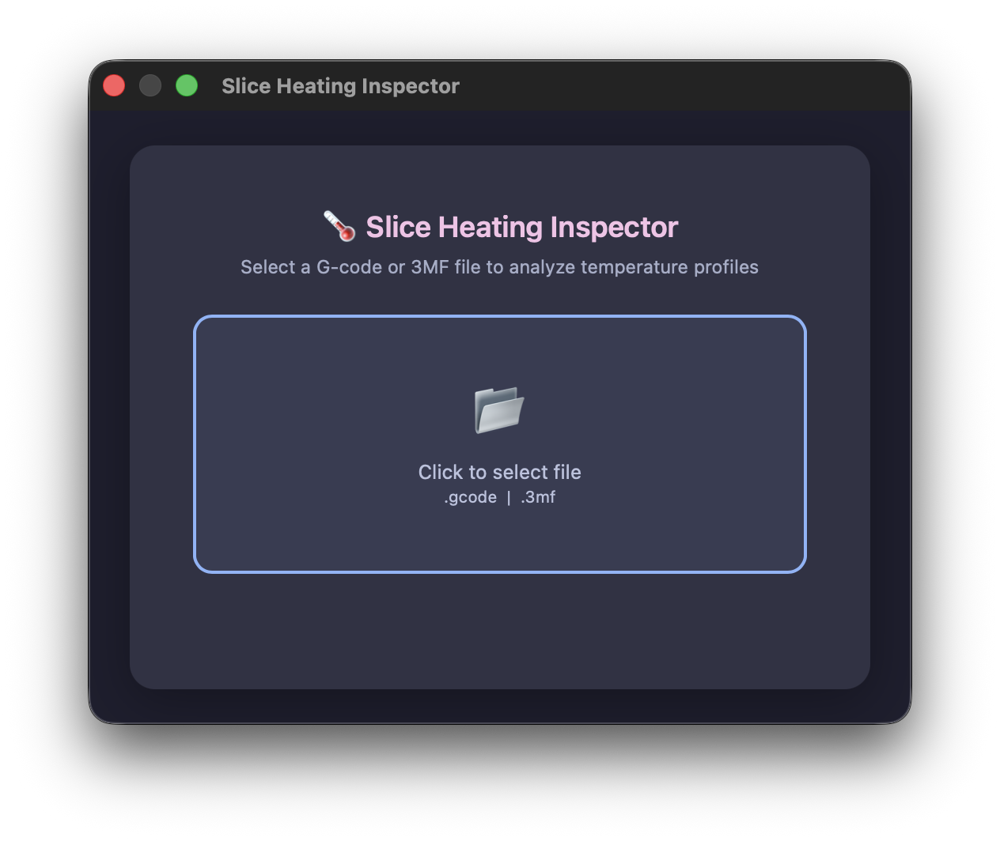

# Slice Heating Inspector — OrcaSlicer Plugin

Interactive temperature timeline visualization for multi-nozzle G-code.

Analyzes preheat/cooldown events, toolchanges, nozzle assignments, and thermal profiles.
Canvas-based zoom/pan/hover inspector with side-by-side comparison support.

## Screenshots

### Comparison Mode — BambuStudio vs OrcaSlicer


### File Picker


## Features

- **Temperature Timeline** — Interactive Canvas graph with per-heater temperature curves
- **Preheat/Cooldown Detection** — Highlights pre-heating and standby cooldown zones
- **Toolchange Markers** — Nozzle change / wipe tower / carousel zones visualized
- **Comparison Mode** — Compare current OrcaSlicer slice with an external 3MF (e.g., BambuStudio)
- **Vortek Nozzle Tracks** — Mini panels showing individual nozzle thermal activity
- **Zoom/Pan/Hover** — Scroll to zoom, drag to pan, hover for synchronized tooltip
- **Slicer Detection** — Automatically identifies OrcaSlicer or BambuStudio from G-code

## Plugin Type

**Script** — manual-run via the **"Run"** button in the Plugins dialog.

Click "Run" → file picker opens → select `.gcode` or `.3mf` → interactive temperature timeline is displayed in a webview window.

---

## Installation

### Method 1: Install from Local File

1. Clone and build:
   ```bash
   git clone https://github.com/dnevera/orca-slice-heating-inspector.git
   cd orca-slice-heating-inspector
   python3 build_wheel.py
   ```
2. Open **OrcaSlicer** (v2.5+)
3. Go to **File → Plugins**
4. Click **"Install Local Plugin"** (the ⊕ button)
5. Select `dist/orca_slice_heating_inspector-0.1.0-py3-none-any.whl`
6. Enable the plugin toggle

### Method 2: Install from OrcaSlicer Cloud Store

1. Open **OrcaSlicer** (v2.5+)
2. Go to **File → Plugins** → **"Explore"** tab
3. Search for **"Slice Heating Inspector"**
4. Click **"Install"**

> **Note:** Cloud installation requires being logged into your OrcaSlicer account.

---

## Usage

1. Open **File → Plugins**
2. Expand **"Slice Heating Inspector"** and check the capability checkbox
3. Click the **▶ Run** button
4. In the file picker, select a `.gcode` or `.3mf` file
5. Interactive temperature timeline opens
6. Click **"Compare"** (bottom-right) to load a second file for side-by-side analysis

---

## Uninstallation

### Local Plugin

1. Open **File → Plugins**
2. Right-click **"Slice Heating Inspector"**
3. Select **"Delete"** → Confirm

Plugin files are in:
| OS | Path |
|----|------|
| macOS | `~/Library/Application Support/OrcaSlicer/orca_plugins/` |
| Windows | `%APPDATA%\OrcaSlicer\orca_plugins\` |
| Linux | `~/.config/OrcaSlicer/orca_plugins/` |

### Cloud Plugin

1. Open **File → Plugins**
2. Find **"Slice Heating Inspector"**
3. Click **"Unsubscribe"**

---

## Files

| File | Description |
|------|-------------|
| `orca_slice_heating_inspector.py` | Plugin entry point — PEP 723 manifest, capability class, UI bridge |
| `thermal_plotter.py` | Timeline builder, data parsers (3MF + raw gcode), HTML generator |
| `gcode_parser.py` | G-code parser — M104/M109/M620/M73/T-commands extraction |
| `template.html` | Canvas-based interactive timeline renderer |

## Requirements

- OrcaSlicer **v2.5+** (with Plugin support)
- Python ≥ 3.12 (bundled with OrcaSlicer)

## Author

Denis Sibilev ([@dnevera](https://github.com/dnevera))
