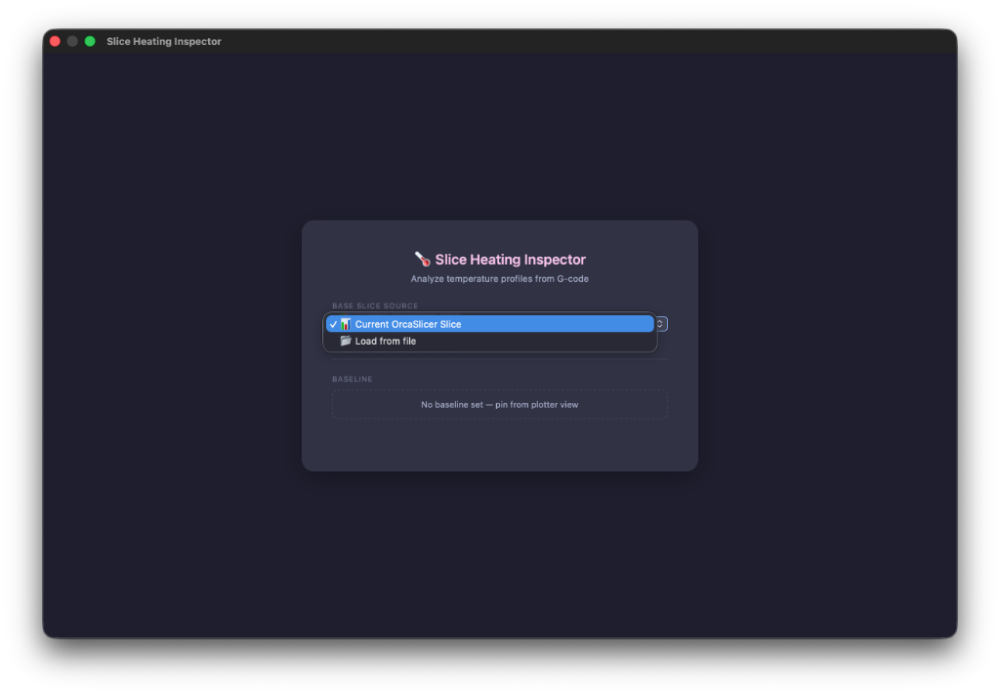
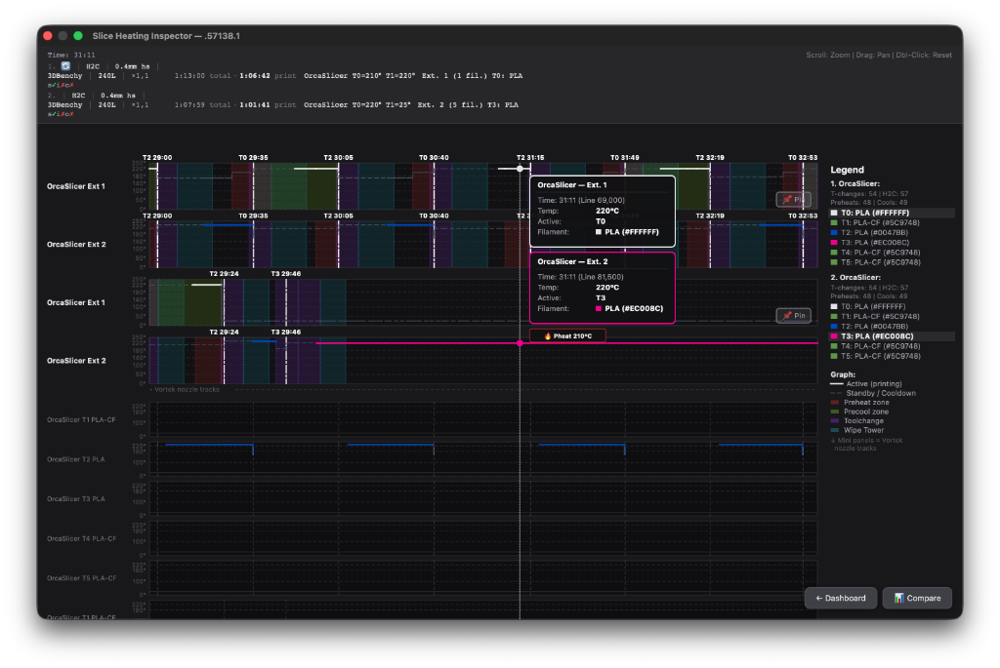

# Slice Heating Inspector — OrcaSlicer Plugin

Interactive temperature timeline visualization for multi-nozzle G-code.

Analyzes preheat/cooldown events, toolchanges, nozzle assignments, and thermal profiles.
Canvas-based zoom/pan/hover inspector with side-by-side comparison and baseline pinning support.

[](https://cloud.orcaslicer.com/p/32d6c5c7b923)






## Features

- **Auto-Capture on Slice** — `SlicingPipeline` hook captures G-code automatically after every slice
- **Dashboard** — Select slice source (Current OrcaSlicer Slice / Load from file), manage pinned baseline
- **Temperature Timeline** — Interactive Canvas graph with per-heater temperature curves
- **Preheat/Cooldown Detection** — Highlights pre-heating and standby cooldown zones
- **Toolchange Markers** — Nozzle change / wipe tower / carousel zones visualized
- **Comparison Mode** — Compare current slice with an external `.gcode` or `.3mf` (e.g. BambuStudio)
- **Baseline Pinning** — Pin any slice as baseline for persistent comparison (📌 Pin)
- **Info Header** — Metadata rows: printer, model, print time, filament count, slicer
- **Legend Highlighting** — Active filament highlighted in legend on cursor hover
- **Vortek Nozzle Tracks** — Mini panels showing individual nozzle thermal activity
- **Zoom/Pan/Hover** — Scroll to zoom, drag to pan, hover for synchronized tooltip
- **Slicer Detection** — Automatically identifies OrcaSlicer or BambuStudio from G-code

## Plugin Capabilities

| Capability | Type | Description |
|------------|------|-------------|
| Slice Heating Inspector | **Script** | Manual-run via ▶ Run button — opens Dashboard |
| Slice Auto Capture | **SlicingPipeline** | Auto-captures G-code on every slice (psGCodePostProcess) |

---

## Installation

### From OrcaSlicer Cloud

1. Open **OrcaSlicer** (v2.5+)
2. Go to **File → Plugins** → **"Explore"**
3. Search for **"Slice Heating Inspector"**
4. Click **"Install"**

> Requires OrcaSlicer Cloud account login.

### From Local File

1. Clone and build:
   ```bash
   git clone https://github.com/dnevera/orca-slice-heating-inspector.git
   cd orca-slice-heating-inspector
   python3 build_wheel.py
   ```
2. Open **OrcaSlicer** (v2.5+)
3. Go to **File → Plugins**
4. Click **"Install Local Plugin"** (⊕)
5. Select `dist/orca_slice_heating_inspector-0.2.0-py3-none-any.whl`
6. Enable the plugin toggle

---

## Usage

1. Open **File → Plugins**
2. Enable **"Slice Heating Inspector"** — both capabilities (Script + Slice Auto Capture)
3. **Auto mode:** Slice any model → plugin auto-captures and refreshes the timeline
4. **Manual mode:** Click ▶ **Run** → Dashboard opens → select source → view timeline
5. In the plotter, click **"Compare"** (bottom-right) to load a second file for side-by-side analysis
6. Click **📌 Pin** to save current slice as baseline for future comparisons

---

## Uninstallation

### Local Plugin

1. Open **File → Plugins**
2. Right-click **"Slice Heating Inspector"**
3. Select **"Delete"** → Confirm

Plugin files location:
| OS | Path |
|----|------|
| macOS | `~/Library/Application Support/OrcaSlicer/orca_plugins/` |
| Windows | `%APPDATA%\OrcaSlicer\orca_plugins\` |
| Linux | `~/.config/OrcaSlicer/orca_plugins/` |

### Cloud Plugin

1. Open **File → Plugins**
2. Find **"Slice Heating Inspector"**
3. Click **"Unsubscribe"**

---

## Files

| File | Description |
|------|-------------|
| `orca_slice_heating_inspector.py` | Plugin entry point — PEP 723 manifest, Script + SlicingPipeline capabilities |
| `thermal_plotter.py` | Timeline builder, data parsers (3MF + raw gcode), HTML generator |
| `gcode_parser.py` | G-code parser — M104/M109/M620/M73/T-commands extraction |
| `template.html` | Canvas-based interactive timeline renderer |
| `dashboard.html` | Dashboard UI — source selection, baseline management |
| `shared_state.py` | Shared state between Script and SlicingPipeline capabilities |

## Requirements

- OrcaSlicer **v2.5+** (with Plugin support)
- Python ≥ 3.12 (bundled with OrcaSlicer)

## Author

[@dnevera](https://github.com/dnevera)
