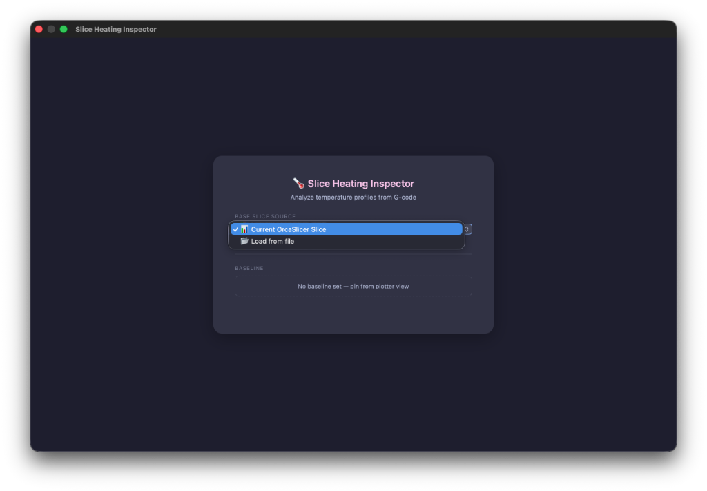
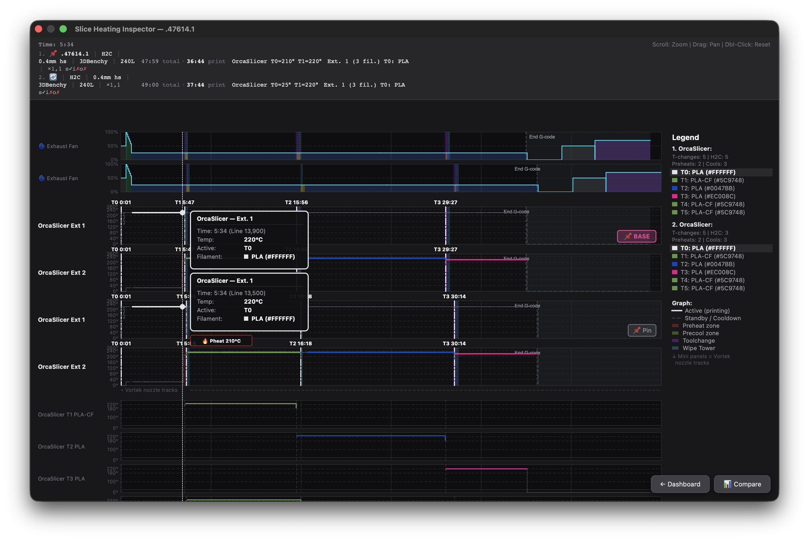
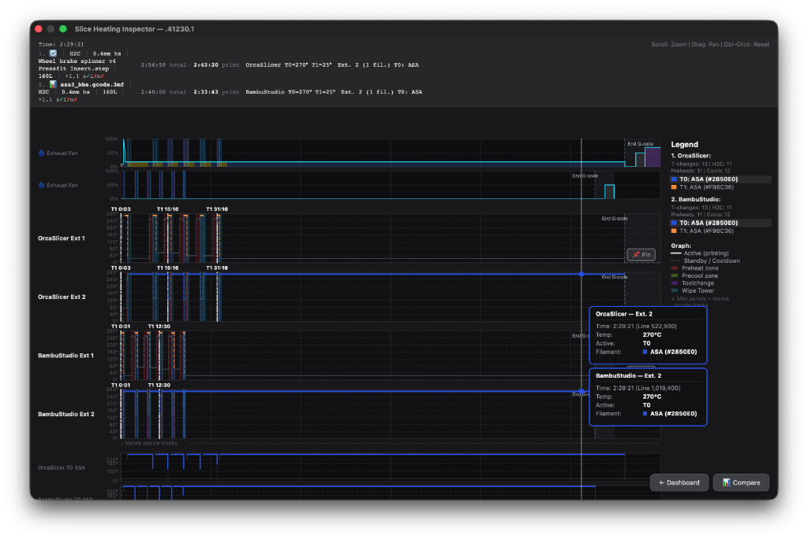

# Slice Heating Inspector — OrcaSlicer Plugin

Interactive temperature timeline visualization for multi-nozzle G-code.

Analyzes preheat/cooldown events, toolchanges, nozzle assignments, and thermal profiles.
Canvas-based zoom/pan/hover inspector with side-by-side comparison and baseline pinning support.

[](https://cloud.orcaslicer.com/p/39f27601157b)






## Features

- **Auto-Capture on Slice** — `SlicingPipeline` hook captures G-code automatically after every slice
- **Dashboard** — Select slice source (Current OrcaSlicer Slice / Load from file), manage pinned baseline
- **Temperature Timeline** — Interactive Canvas graph with per-heater temperature curves
- **Preheat/Cooldown Detection** — Highlights pre-heating and standby cooldown zones
- **Toolchange Markers** — Nozzle change / wipe tower / carousel zones visualized
- **Comparison Mode** — Compare current slice with an external `.gcode` or `.3mf` (e.g. BambuStudio)
- **Baseline Pinning** — Pin any slice as baseline for persistent comparison (📌 Pin)
- **Info Header** — Metadata rows: printer, model, print time, filament count, slicer
- **Legend Highlighting** — Active filament highlighted in legend on cursor hover
- **Vortek Nozzle Tracks** — Mini panels showing individual nozzle thermal activity
- **Exhaust Fan Track** — Dedicated panel for `M106 P3` fan activity with phase-colored zones
- **Zoom/Pan/Hover** — Scroll to zoom, drag to pan, hover for synchronized tooltip
- **Slicer Detection** — Automatically identifies OrcaSlicer or BambuStudio from G-code

### Exhaust Fan Track

The Inspector includes a dedicated **Exhaust Fan** panel that visualizes all `M106 P3` (exhaust/chamber fan) commands on the timeline.



When used with the companion [**Bambu Exhaust Enforcer**](https://github.com/dnevera/bambu-exhaust-enforcer) plugin, each fan command is color-coded by phase:

| Phase | Color | Description |
|-------|-------|-------------|
| Startup | 🟢 Green | Initial exhaust blast at print start |
| Ramp | 🟢 Green | Smooth ramp-down from startup to target |
| Heating | 🟠 Orange | Low exhaust during chamber warmup |
| Printing | 🔵 Blue | Active printing — layer-by-layer enforcement |
| TC Recovery | 🟣 Purple | Re-injection after tool change |
| Post-Print | 🔴 Red | Extended exhaust purification |
| Native | ⚫ Grey | Firmware fan commands (not injected by Enforcer) |

Hovering over the exhaust panel shows a tooltip with the current fan percentage and active phase.

> **Note:** Without the Exhaust Enforcer, the panel still shows any native `M106 P3` commands in the G-code — they appear as "native" phase (grey).

## Plugin Capabilities

| Capability | Type | Description |
|------------|------|-------------|
| Slice Heating Inspector | **Script** | Manual-run via ▶ Run button — opens Dashboard |
| Slice Auto Capture | **SlicingPipeline** | Auto-captures G-code on every slice (psGCodePostProcess) |

---

## Installation

### From OrcaSlicer Cloud

1. Go to [**Plugin Hub**](https://cloud.orcaslicer.com/app/plugins/plugin-hub)
2. Find **"Slice Heating Inspector"** and click **Subscribe**
3. Open **OrcaSlicer** → **File → Plugins** → the plugin appears with Source **Subscribed**
4. Check **Activate** to enable it

### From Local File

1. Build the `.whl`:
   ```bash
   git clone https://github.com/dnevera/orca-slice-heating-inspector.git
   cd orca-slice-heating-inspector
   python3 build_wheel.py
   ```
2. Open **OrcaSlicer** → **File → Plugins**
3. Click **Install plugin ▾** → **Install local plugin**
4. Select `dist/orca_slice_heating_inspector-0.3.0-py3-none-any.whl`
5. The plugin appears with Source **Mine** — check **Activate** to enable it

---

## Usage

1. Open **File → Plugins**
2. Enable **"Slice Heating Inspector"** — both capabilities (Script + Slice Auto Capture)
3. **Auto mode:** Slice any model → plugin auto-captures and refreshes the timeline
4. **Manual mode:** Click ▶ **Run** → Dashboard opens → select source → view timeline
5. In the plotter, click **"Compare"** (bottom-right) to load a second file for side-by-side analysis
6. Click **📌 Pin** to save current slice as baseline for future comparisons

---

## Companion Plugin: Bambu Exhaust Enforcer

The **Exhaust Fan Track** panel works best with [**Bambu Exhaust Enforcer**](https://github.com/dnevera/bambu-exhaust-enforcer) — a plugin that injects `M106 P3` commands to enforce exhaust fan behavior on Bambu Lab H2C printers.

| With Enforcer | Without Enforcer |
|---|---|
| Exhaust track shows phase-colored zones (startup, ramp, heating, printing, TC recovery, post-print) | Only native firmware fan commands shown (if any) |
| Each command tagged with `[exhaust-enforcer]` for clear attribution | All commands shown as "native" phase |

### ⚠️ Pipeline Order Matters

Both plugins run at the `psGCodePostProcess` step. The **Exhaust Enforcer must be activated before the Inspector** — it injects M106 P3 commands into G-code, and the Inspector then reads the final G-code to build the exhaust track.

In OrcaSlicer, pipeline execution order follows plugin **activation order** in **File → Plugins**:

```
1. ✅ Bambu Exhaust Enforcer    ← injects M106 P3 into G-code
2. ✅ Slice Heating Inspector    ← reads final G-code (with injected commands)
```

> **Tip:** If the Exhaust Fan Track appears empty while using the Enforcer, check the plugin order — deactivate both, then activate Enforcer first, Inspector second.

---

## Uninstallation

1. Open **File → Plugins**
2. Right-click **"Slice Heating Inspector"**
3. Select **"Delete"** (local) or **"Unsubscribe"** (cloud)

---

## Files

| File | Description |
|------|-------------|
| `orca_slice_heating_inspector.py` | Plugin entry point — PEP 723 manifest, Script + SlicingPipeline capabilities |
| `thermal_plotter.py` | Timeline builder, data parsers (3MF + raw gcode), HTML generator |
| `gcode_parser.py` | G-code parser — M104/M109/M620/M73/T-commands extraction |
| `template.html` | Canvas-based interactive timeline renderer |
| `dashboard.html` | Dashboard UI — source selection, baseline management |
| `shared_state.py` | Shared state between Script and SlicingPipeline capabilities |

## Requirements

- OrcaSlicer **v2.5+** (with Plugin support)
- Python ≥ 3.12 (bundled with OrcaSlicer)

## Author

[@dnevera](https://github.com/dnevera)
